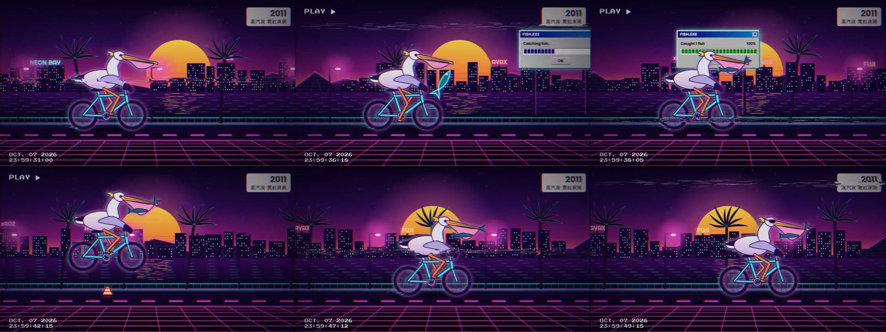
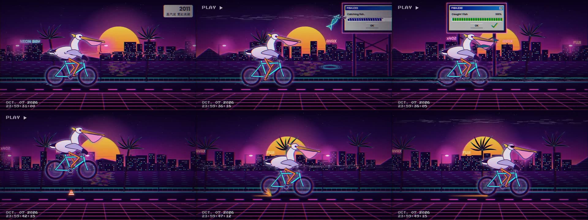

# 演示案例：看不了视频的剪辑 agent，在 BF Market 上按次买 Gemini 审片

日期：2026-10-07（Asia/Shanghai）
网络：Avalanche Fuji（eip155:43113），测试 USDC `0x5425890298aed601595a70AB815c96711a31Bc65`
服务：`video-gemini-3-8-flash`（BeefAPI 提供的 Gemini 3.8 Flash，原生多模态），x402 `upto` 按量计费
原始记录：`fuji-video-review-v1.json` … `fuji-video-review-v4.json`（同目录）

## 场景

做视频的 agent（Codex、Claude、DeepSeek 一类）能写代码出片，但自己看不了成片。它只知道 BF Market 的地址：读 `/discovery/resources`，按描述找到一个能看视频的服务，拿到 402 报价，签一个 Permit2 `upto` 授权，把成片链接和审片要求发过去，拿回带时间码的审片意见，然后改片、再审。整个过程没有账号、没有 API key，钱从 agent 的钱包直接付给服务商。

被审的片子是一支 20 秒的「鹈鹕骑自行车」测试片（蒸汽波霓虹风格），由剪辑 agent 用代码逐帧绘制（huashu 艺术动画工程，Canvas 程序化绘制，没有用任何生图模型）。片子的四个设计节拍：沿海边骑行；约 0:07 鱼跃出海面落进喉囊，广告牌 FISH.EXE 进度条随之走满；约 0:12 跳过路障锥；约 0:17 刹车停下、墨镜落到脸上。

脚本：`scripts/video-review-demo.ts`。服务端：`src/llm.ts`（视频下载与转发）、`src/services.ts`（目录条目），测试 `tests/video-metered.test.ts`。

## 四轮审片

每一轮都是一次真实的 Fuji 付费调用。报价上限都是 38600 atomic（0.0386 USDC，按 64000 输入 token + 2200 输出 token 计），实际只收用量。

| 版本 | 这一版改了什么 | Gemini 的主要意见 | 实收 (USDC) | 结算交易 |
|---|---|---|---|---|
| v1 | 首版 | 看不出刹车；鱼一直横叼在嘴尖，不像进了喉囊；广告牌像飘着的窗口 | 0.005137 | [0x7495…a502](https://testnet.snowtrace.io/tx/0x7495758dab54cf6b266fa90ebdf61f31dfbd1fe4dc783c6a26517fa75007a502) |
| v2 | 加刹车火花和拖痕；鱼尾露 0.7 秒后吞下，喉囊鼓起；广告牌加立柱、横撑、射灯和灯管外框 | 刹车火花能读出，喉囊鼓起能读出；鱼像从路面后轮旁边冒出来 | 0.005737 | [0x3623…1e91](https://testnet.snowtrace.io/tx/0x3623de3bbd02279d763cf5a2010f716ed5bbe05f218b4bbba87500557c1d1e91) |
| v3 | 鱼改从前方远处的海面起跳；广告牌抬到鹈鹕头顶以上；右上角风格牌 4 秒后淡出 | 鱼「凭空消失、没进嘴」（0.95 秒的飞行被采样漏掉，见下） | 0.002686 | [0xebcb…603d](https://testnet.snowtrace.io/tx/0xebcb78ebd7fbd7ec6cd9b49e82db520e895721c89173225040c387b3e39d603d) |
| v4 | 鱼的飞行拉长到 1.7 秒，鱼尾在嘴外停 1.4 秒再吞 | 四个节拍全部读出：00:06 鱼跃出水面、00:08 进喉囊、00:12 跳过锥、00:17 刹车火花、00:18–19 墨镜落下 | 0.004948 | [0xb314…5ef8](https://testnet.snowtrace.io/tx/0xb3141a61f206a471a64cacf7a98c048402844e71e6dc7bcdf71955407d9e5ef8) |

四轮合计 0.018508 USDC。每笔交易都已在链上核对：状态 success，USDC Transfer 从买家 `0xED38064D9af2175d564344B15185663bdaeb31c6` 到服务商收款地址 `0x24C2F88a3DfC7a14F44E9F5e3A903434794e277e`，金额与返回的 `charged` 一致。服务商是链上 ERC-8004 agent 253。

成片（每一版都可直接播放）：

- v1 https://market-fuji.bflabs.app/demo/pelican-neon-ride-v1.mp4
- v4 https://market-fuji.bflabs.app/demo/pelican-neon-ride-v4.mp4（v2、v3 同路径）

关键帧对比（第 1、6.6、8.2、12.5、17.4、19.5 秒）：

## 如实说明

- **审片会误读。** v2–v4 都说刹车后「背景还在滚」。实际相机在 17.0 秒停住，之后只有海浪、星星闪烁和 VHS 噪声带这些环境动画在动；鹈鹕在 18.4 秒停稳，曲柄不再转。v3 说鱼「凭空消失」，逐帧检查 7.4 秒时鱼已经落进喉囊。剪辑 agent 应该把审片当成线索，再用单帧核对，而不是照单全收。
- **大约每秒一帧。** 从 v3 的误判看，模型对不到 1 秒的动作不可靠。v4 把关键动作拉长到 1 秒以上后才被稳定读出。这对任何靠模型审片的流程都适用。
- **用量口径。** BeefAPI 报告的输入 token 每次都是 1495（20 秒 720p 视频加提示词），比 Gemini 公开的每秒视频 token 数低；我们按 BeefAPI 报告的用量计费，和 BeefAPI 向平台收取的口径一致。
- **视频由服务端下载。** 买家只给一个公开 https 链接（20 MB 以内的 mp4/mov/webm）；服务端拒绝 IP 字面量、本地域名和带凭据的链接，下载失败不收费。视频先下载再内联转发给模型，不把买家链接交给上游。
- **不是人类审片。** 这四轮是付费模型审片，用来演示「agent 买能力」；上面对误读的判断来自逐帧静帧核对和 huashu QA（每版运动约 19%、无静止帧、无跳变、两次渲染逐像素一致）。
